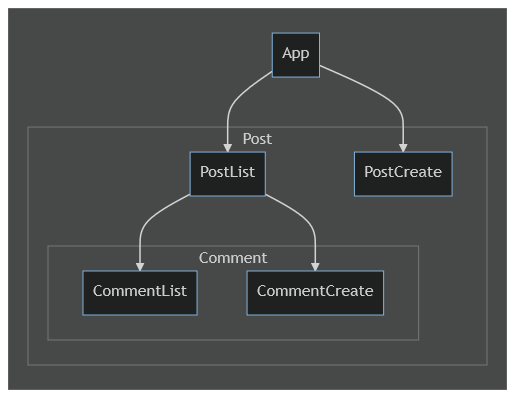
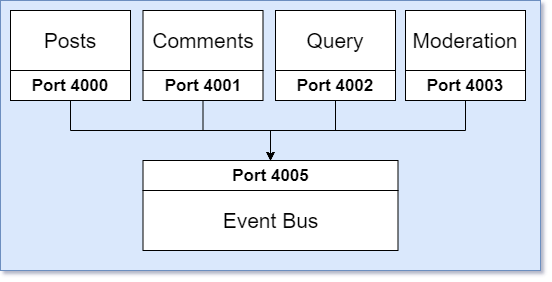

# Project

## Pre-requisite setup
 * Install docker and kubernetes
 * Install node npm

## Install dependences and build only for client
    1. cd client
    2. npm install
    3. npm run build
    4. cd ..

## Execute to creating docker images for microservices
    docker build -t tanweerhossain/client client/.
    docker build -t tanweerhossain/posts posts/.
    docker build -t tanweerhossain/comments comments/.
    docker build -t tanweerhossain/query query/.
    docker build -t tanweerhossain/event-bus event-bus/.
    docker build -t tanweerhossain/moderation moderation/.

## Push the created docker images to the personal docker hub repo
    docker push tanweerhossain/client:latest
    docker push tanweerhossain/posts:latest
    docker push tanweerhossain/comments:latest
    docker push tanweerhossain/query:latest
    docker push tanweerhossain/event-bus:latest
    docker push tanweerhossain/moderation:latest

## To run Kubernetes cluster
> * kubectl apply -f infra/kubernetes/ ***[ Run in Powershell, Linux or Unix terminal ]***
> * kubectl apply -f infra\kubernetes\ ***[ Run in Windows Command Prompt ]***

## Setup local DNS using hosts file
1. For windows ___C:\Windows\System32\drivers\etc\hosts___
   *  127.0.0.1 client.com
   *  127.0.0.1 posts.com
   *  127.0.0.1 comments.com
   *  127.0.0.1 query.com
2. For Linux ___/etc/hosts___
   *  127.0.0.1 client.com
   *  127.0.0.1 posts.com
   *  127.0.0.1 comments.com
   *  127.0.0.1 query.com
## Open Url in Browser ___http://client.com___

## Compenent Tree Diagram

## Micro-service Structure Diagram

## Services inside micro-service

## Infra Structure
